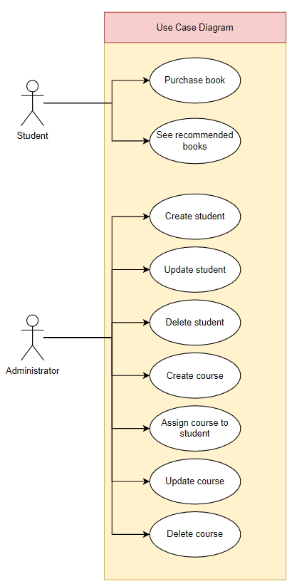
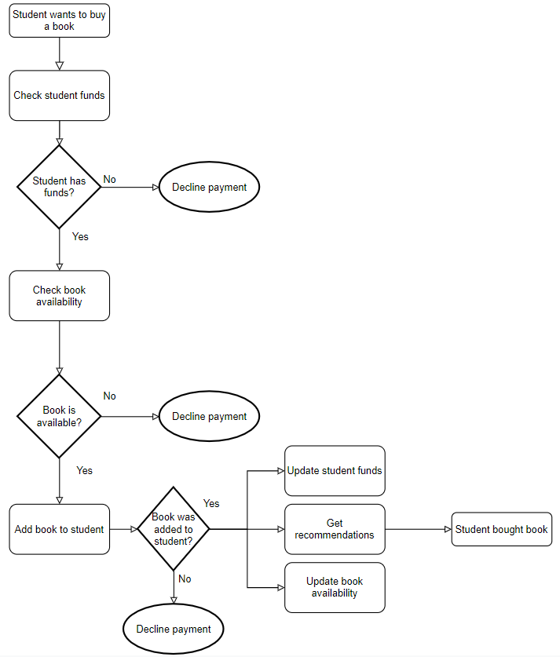
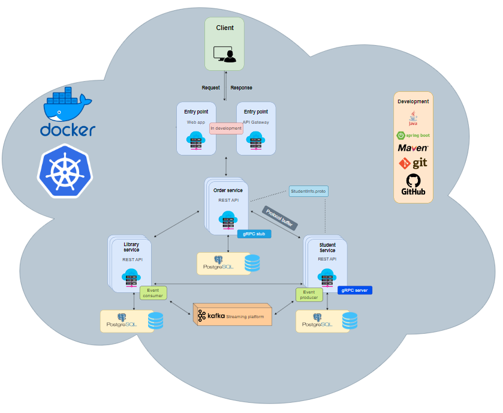
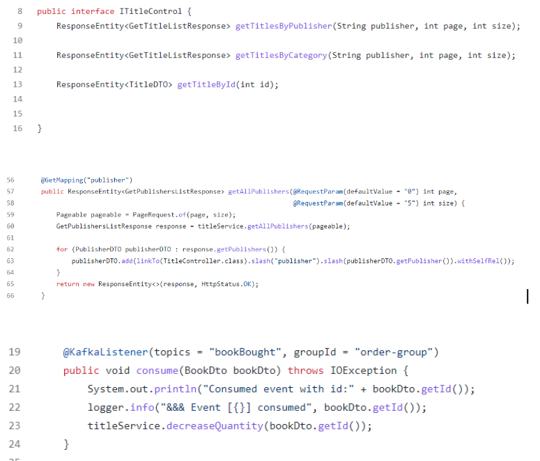
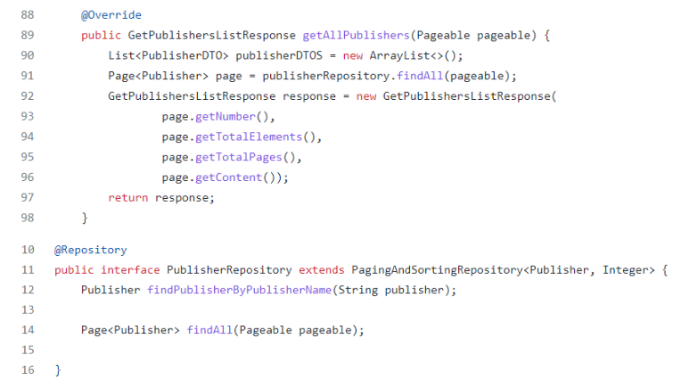
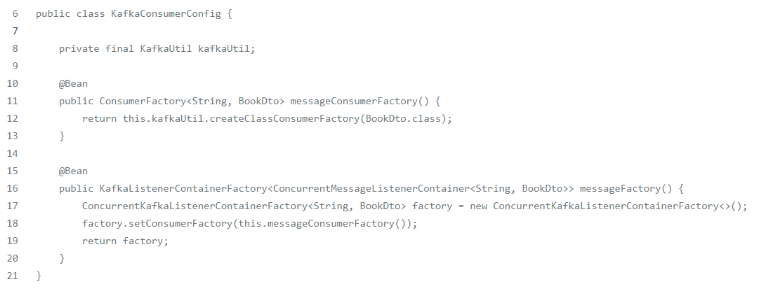

# System-Integration-Assignment-3

## Group Members

- Frederik Johnsen, cph-fj111@cphbusiness.dk
- Jean-Poul Leth-Møller, cph-jl360@cphbusiness.dk
- Mathias Parking, cph-mp525@cphbusiness.dk
- Magdalena Wawrzak cph-mw216@cphbusiness.dk
- Tobias Zimmermann cph-tz11@cphbusiness.dk

## 1.0 Project requirements
*All requirements for this project can be found in the following link:*  
  
- [Objective for this assignment](./files/A4-MP3.pdf)  
  
### 1.1 Services

- [Library Service](https://github.com/team-rocket-we-are-blasting-of-again/library-resources-service)  
- [Order Service](https://github.com/team-rocket-we-are-blasting-of-again/library-resources-service)
- [Student Service](https://github.com/team-rocket-we-are-blasting-of-again/sys-3-student-service)  
  
### 1.2 Functional and non-functional requirements
This section describes the functional and non-functional requirements of the system.  
  
**NFR** = Non-functional requirement  
**R** = Functional requirement    
  
#### **Non-functional requirements**   
  
**NFR1:** The system must be made using a microservice architecture, so as to decouple the
services and make the system modular. Making it easier to maintain, test and deploy each
service separately.  
  
**NRF2:** The system must use orchestration and container technology, so that the system
becomes easily scalable with high availability.  
  
**NFR3:** The system must make use of events, when a purchase of a book has been made by
a student.  
  
**NFR4:** The system must make use of remote procedure calls to make service interactions
faster.  
  
**NFR5:** The services must use a web-based API, so that future user-applications can make
use of this system equally.  
  
#### **Functional requirements**  

**R1:** As a student, I want to be able to purchase a book, so that I can have learning material
related to my assigned courses.  
  
**R2:** As a student, I want to be able to receive book recommendations, so that I will have an
easier time buying books that are relevant to me.  
  
**R3:** As an administrator, I want to be able to create students in the system, so that students
can be administered more easily.  
  
**R4:** As an administrator, I want to be able to update student information, so that students’
information can be made up to date.  
  
**R5:** As an administrator, I want to be able to create courses in the system, so that students
will know about course information and the relevant learning materials.  
  
**R6:** As an administrator, I want to be able to assign courses to students, so that students get
the correct course information.  
  
**R7:** As an administrator, I want to be able to update course information, so that course
information can be managed and made up to date.  
  
**R8:** As an administrator, I want to be able to delete courses, so that outdated and irrelevant
courses can be removed from the system.    
  
The functional requirements are represented in section 2.1.  
     
## 2.0 Diagrams  
  
### 2.1 Use dase diagram  
The following diagram shows all our use cases:  
   
  

### 2.2 Flow chart diagram
The following is a flow chart of the flow in our system when attempting to buy a book:  

 
  
## 3.0 Architecture style  
This following picture shows an overall system architecture:  
     
    
### 3.1 Architecture styles  
The following is a list over the architecture styles used in developing this system:  
- Event driven architecture (Pub/Sub)      
- Hexagonal   
- Microservices    
- REST   
    
APIs used in this system:  
- REST (Library service has obtained level 3 with HATEOS)    
- gRPC (client on order service and server on student service)    
  
### 3.2 Hexagonal architecture    
Library Resources Service is designed in accordance with the determinants of hexagonal architecture. We distinguish the following:
    
- **Application layer:** consists of REST API interfaces and controllers as well as Kafka Event Listener
  
  
     
The interface describes how the system can be called with REST endpoints - endpoints  are implemented according to the application logic.   
  
- **Domain layer:** consists of services and repositories. Here the state of business objects is maintained as well as CRUD operations take place.  
  
  
  
- **Infrastructure layer:**  It is responsible for interaction with the message broker as well as with the database. We let the Hibernate framework steer connection to the database.     
 
   

## TODO:  
EVERYTHING WITH ORDER SERVICE (README AND CODE)  

The task includes a peer review of other project solutions. The review should address 
questions about:
- the proper selection of technologies and the criteria, used for making the choices
- the quality of the design
- the readability of the diagrams and the code
- the readiness for further extention and upgrade of the system with new 
microservices
- the proper use of standards, recommendations, and the best practices od software 
development